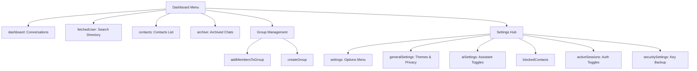

# Brand & Design Guidelines

This document provides a comprehensive guide to the **"M"** brand identity, design tokens, UI component ecosystem, and dashboard architecture. Use this as a reference to maintain strict design standards, token consistency, and visual premium feel when building new features.

---

## 1. Brand Identity & Colors

### Core Logo Mark
The brand is represented by a bold, black serif-like high-contrast identifier:
```tsx
<h1 className="text-2xl text-primary font-black">M</h1>
```

### Harmonious Color Palette
Rather than generic palettes, the interface is designed around carefully selected primary theme options that programmatically generate matching shades and tints.

| Color Token | Hex Code | Purpose | Preview |
| :--- | :--- | :--- | :--- |
| `lightPurple` | `#9b3ff3` | Default / Premium Accent | <span style="background-color:#9b3ff3; display:inline-block; width:12px; height:12px; border-radius:3px;"></span> |
| `blue` | `#6580fb` | Tech / Professional Accent | <span style="background-color:#6580fb; display:inline-block; width:12px; height:12px; border-radius:3px;"></span> |
| `orange` | `#ff6726` | Playful / Energetic Accent | <span style="background-color:#ff6726; display:inline-block; width:12px; height:12px; border-radius:3px;"></span> |

### Theme Generation & Shadows
Every theme supports light and dark modes (e.g., `light-9b3ff3` or `dark-9b3ff3`) mapped using custom hooks. Programmatic helper `generateRelatedColors()` automatically creates shades (darker) and tints (lighter) dynamically at `10%` increments to render elegant bento grids and gradient containers.

---

## 2. Adaptive Styling & Tokens

To support seamless transitions between light and dark modes, the application implements **semantic CSS custom variables** mapped onto DaisyUI base classes.

### The Contrast & Tone Rule
When editing layout components, **do not** use static colors like `bg-white` or `text-black`. Use adaptive token variables:

*   `bg-[--base-200-300]`: Dynamic dark/light gray box background.
*   `text-[--black-white]`: Contrasting text that adapts dynamically (black in light mode, white in dark mode).
*   `border-base-content/5` / `border-base-content/10`: Uses the theme content color with extremely low opacity for premium subtle dividers.
*   `no-scrollbar`: Built-in utility to hide standard browser scrollbars while keeping overflow scrolling interactive.

---

## 3. Spacing, Layout & Border Radius Standards

Maintaining structural rhythm requires strict adherence to standardized spacings, layouts, and corner radiuses.

### 📐 Corner Shape & Border Radius Tokens
We enforce a smooth corner system that decreases in radius size as elements are nested deeper.

*   `rounded-full`: Circular containers. Standard for user profile avatars (`Avatar`), badge pills (`badge-outline`), round control buttons (`btn-circle`), and selection status bubbles.
*   `rounded-2xl` (16px): Outer layout containers. Used for primary sidebar panels (Navbar blocks), adaptive search bars (`Searchbar`), dynamic input zones, and main dashboard widgets.
*   `rounded-xl` (12px): Floating or micro-modal containers. Used for floating popup menus, dropdown cards, in-app emoji pickers, and color configuration tiles.
*   `rounded-lg` (8px): Inline pill tags (`TagInput` items), badges, internal select highlights.
*   `rounded-none` (0px): Edge-to-edge viewports (such as full-screen mobile image viewer screens or flat bottom-bordered text editors).

### 📐 Padding & Margin Standards
*   **Adaptive Viewport Gutters**: Use `max-sm:px-0 px-4` on primary setting panels. This keeps the desktop layout comfortably indented while running fully responsive, edge-to-edge screens on mobile browsers.
*   **Inner Panel Indentation**: Maintain standard alignment buffers inside form sections using `pl-2 py-2` combined with bottom borders (`pb-4`) to highlight hierarchical groups cleanly.
*   **Compact Sidebar Blocks**: Use tight block boundaries (`p-3 py-4` or `px-3 py-2` on search nodes) to preserve desktop spatial efficiency.
*   **Targeted Alignments**: Keep floating contextual menus aligned cleanly using specialized offsets (like `ml-5 mt-2` on dropdown absolute overlays).

### 📐 Gaps & Vertical Rhythm
*   **Outer Layout Panels**: Major settings columns are separated using dynamic responsive gaps: `max-sm:gap-8 gap-10` to divide sections.
*   **Form & Control Grids**: Wrap form controls inside grids using standard 1rem gutters: `grid gap-4`.
*   **Micro Row Elements**: Inline text-and-icon nodes must utilize compact row gaps: `gap-1.5` or `gap-2` (e.g., active session details, badge elements, tab headers).

---

## 4. Typography & Visual Hierarchy Standards

To establish a clear visual hierarchy across dark and light configurations, the codebase leverages Tailwind font features and content opacity classes rather than arbitrary gray overrides.

### 🔤 Content Opacity Scale
Text emphasis is mapped directly to the parent content color to guarantee contrast adaptability:
*   **Primary Copy / High-Contrast Labels**: `text-base-content` (Full contrast, defaults to white/black depending on active theme).
*   **Secondary Context / Paragraphs**: `text-base-content/60` (Comfortable metadata reading weight. Used for settings context descriptions).
*   **Muted Context / Informative Accents**: `text-base-content/40` (Subtle metadata, helper hints, idle icon outlines).
*   **High-Contrast Dynamic Accents**: `text-[--black-white]` (Enforces contrasting reading readability on colored buttons).

### 🔤 Font Weights & Sizing
*   `font-black`: Enforced exclusively on the main brand Logo mark (`text-2xl font-black`).
*   `font-semibold`: Enforced on high-fidelity titles, form section labels, and conversational headers (`text-sm font-semibold`).
*   `font-bold`: Enforced on active action items, button texts, status indicator pills, and focus points.
*   `text-sm` (Standard reading base) and `text-xs` (Metadata base) compose 90% of dashboard settings text blocks.

---

## 5. Border, Shadow & Transition Standards

To preserve the tactile and premium aesthetic of the layout, elevations and dividers are implemented with subtle parameters.

### 🧱 Border Dividers & Input Underlines
*   `border-base-content/5` (or `/10`): Enforced standard for dividing lines inside settings lists. Establishes clean visual sections without heavy solid separators.
*   `border-b-2 border-b-primary` / `border-b-transparent`: Standard configuration for text input focus rings (`TextInput`). Inputs transition elegantly without creating full outline shifts.

### 🧱 Shadows & Elevations
Elevations are utilized selectively to create a distinct layout layers system:
*   `shadow-sm`: Used on active flags, status badges, and compact tags to float slightly above list tiles.
*   `shadow-md`: Standard elevation for interactive grid options, selection cards, and theme nodes.
*   `shadow-lg`: Reserved for absolute navigation bars, search inputs (`Searchbar`), and floating overlay dropdown containers.

### 🧱 Animations & Transition Timings
*   `duration-200` (200ms): The default transition timing for hover overlays, focus state highlights, underline animations, and button triggers.
*   `duration-300` (300ms): Reserved for larger viewport layout shifts (e.g., mobile navigation drawer slides in the main Dashboard).

---

## 6. Iconography & Layout Metrics

Strict bounds are imposed on icons and alignment zones to align all views onto a static layout grid.

### 📐 Icon Sizing Conventions
*   **Standard Action Icons**: All icons rendered inside settings, buttons, and row items must be sized to `size-5` (20px) or `w-5 h-5`.
*   **Floating Control Icons**: Small round helpers and action buttons use compact bounds: `btn-circle btn-xs` (24px targets).
*   **Media Overlays / Camera Icons**: Absolute overlay triggers are expanded to `size-7` (28px).

### 📐 Standard Header Heights
*   All dashboard panels and profile blocks utilize a standardized header section with a `min-h-16` (64px) spacer to align page headers identically.

---

## 7. Core Component Library (`features/ui`)

### 🟢 `Avatar.tsx` (Adaptive Profile Indicator)
The avatar component is visually polished to show connectivity states, handle image placeholders gracefully, and support interactive upload triggers.

```tsx
import Avatar from "@features/ui/Avatar";

// Static Avatar with Online State
<Avatar url={user?.profilePicture} online={true} size="40px" />

// Interactive Avatar with Camera Upload Overlay
<Avatar 
  url={user?.profilePicture} 
  enableOptions={true} 
  onChange={(base64) => handleUpload(base64)} 
  size="100px" 
/>
```
*   **Key design features**:
    *   Dynamic background mapping via `bg-[--avatarBg]`.
    *   Smooth camera overlay transition with `backdrop-blur-md` on hover.
    *   Clean online-dot indicator with `bg-green-400`.

### 🟢 `TextInput.tsx` (Seamless Inline Editing)
Switches elegantly from standard inline text to an interactive editor with an integrated emoji picker.

```tsx
import TextInput from "@features/ui/TextInput";

<TextInput
  text={bioText}
  label="About"
  placeholderText="Tell us about yourself..."
  onSubmit={(newText) => updateBio(newText)}
  onDelete={() => clearBio()}
/>
```
*   **Key design features**:
    *   Transitions into edit mode with an underline `border-b-primary`.
    *   Utilizes `@floating-ui/react` and `framer-motion` for fluid floating emoji pickers.

---

## 8. Dashboard Architecture & Tabs

The dashboard operates on a strict **two-tier tabs system** designed to maximize space and maintain context on mobile viewports.

### Tier 1: Device / Viewport Drawer Routing
Active layout transitions dynamically using responsive media queries:
*   `dashboard`: The primary navigation and sidebar directory.
*   `chatarea`: Triggered on mobile viewports (`max-width: 640px`) to full-screen the conversation.

### Tier 2: Dashboard Content Tab Map
Inside the dashboard sidebar, navigation is component-driven, powered by Zustand state:



### Tab Configuration Code Pattern
Tabs are declared cleanly using declarative structures:
```tsx
import { Tab, Tabs } from "@features/ui/Tab";

<Tabs activeTab={dashboardTab} initialTab="dashboard">
  <Tab component="dashboard">
    <Conversations />
  </Tab>
  <Tab component="settings">
    <Settings />
  </Tab>
</Tabs>
```

---

## 9. Profile Panel Hierarchy

The right-hand side context panel manages detail views according to conversation types:

1.  **Group Chat Context (`GroupProfile`)**: Shows details, shared media grid, invite links, and active participant selectors.
2.  **User Context (`UserProfile`)**: Shows clean bio metadata, notification silencers, last seen parameters, and options to delete or block.
3.  **Starred Content (`StarredMessages`)**: Bento-like card grid showcasing all starred texts.
4.  **System Notifications (`SystemProfile`)**: Dedicated security alerts and authorization logs.
5.  **Ai Assistant View (`AiProfile`)**: Custom settings to tailor the prompt behavior and execution styles of the inline AI helper.

---

## 10. Layout & Bento Grid Best Practices

When adding new components to General Settings or other panels, follow the established structural rhythm:

```tsx
<div className="grid gap-4 max-sm:px-0 px-4">
  <label className="text-sm text-primary">Section Title</label>
  <div className="flex items-start justify-between gap-6 pl-2 py-2 border-b border-base-content/5 pb-4">
    {/* Component content goes here */}
  </div>
</div>
```

*   **Grid Spacing**: 1rem (`gap-4`) spacing on standard forms.
*   **Dividers**: Standard bottom-border `border-b border-base-content/5 pb-4`.
*   **Controls**: Use DaisyUI primary toggles (`toggle toggle-primary toggle-sm`) or checkboxes (`checkbox checkbox-primary checkbox-sm`).
